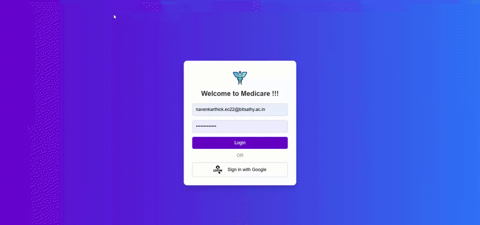

# **🏥 Live Patient Monitoring System**  

A **real-time health monitoring** system that displays **heart rate and oxygen level** data for patients using **ESP32**, **Firebase**, and **modern web UI**.  

## **📌 Features**  
✅ **Real-time Patient Data** from Firebase  
✅ **Live Monitoring UI** with attractive cards  
✅ **Two Separate Charts** for heart rate & oxygen level  
✅ **Responsive & Modern Design**  
✅ **Supports ESP32-based sensor data**  

---

## **🛠️ Tech Stack**  

- **Frontend:** HTML, CSS, JavaScript  
- **Backend:** Firebase Realtime Database  
- **Hardware:** ESP32 + Sensors  

---

## **📷 Project Preview**  
### **Live Dashboard UI**  



## **🚀 Setup & Installation**  

### **1️⃣ Clone the Repository**  
```bash
git clone https://github.com/your-username/live-patient-monitoring.git
cd live-patient-monitoring
```

### **2️⃣ Install Dependencies (if needed)**  
```bash
npm install
```

### **3️⃣ Setup Firebase**  
1. Create a Firebase project at [Firebase Console](https://console.firebase.google.com/)  
2. Add a **Realtime Database** and enable read/write permissions  
3. Copy your Firebase configuration and update `scripts.js`  

### **4️⃣ Start the Web App**  
Open `index.html` in your browser 🚀  


## **📜 License**  
This project is **open-source** under the [MIT License](LICENSE).  

---

## **📞 Contact**  
📧 Email: navenkarthickm@gmail.com
🚀 GitHub: [Navenkarthick](https://github.com/Navenkarthick)  
